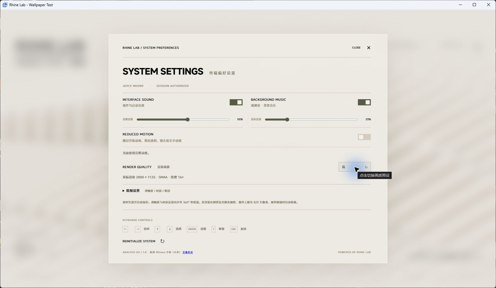

# Wallpaper Engine 本地实验

分支：`codex/wallpaper-engine`。2026-09-10 已在本机 Wallpaper Engine 的独立窗口中运行，尚未发布创意工坊、尚未应用到桌面，不合并主分支。

## 本机入口

Wallpaper Engine 本地库名称：**Rhine Lab · 莱茵生命档案终端（本地测试）**。

安装目录：`D:\Game\Steam\steamapps\common\wallpaper_engine\projects\myprojects\rhine-lab-local`。

当前预览窗口：**Rhine Lab - Wallpaper Test**。重新打开独立预览：

```powershell
& 'D:\Game\Steam\steamapps\common\wallpaper_engine\wallpaper64.exe' -control openWallpaper -file 'D:\Game\Steam\steamapps\common\wallpaper_engine\projects\myprojects\rhine-lab-local\project.json' -playInWindow 'Rhine Lab - Wallpaper Test' -width 1600 -height 900
```

项目目录中的 `project.json` 带有本地标题、预览图片和可调属性。只有构建产物目录应导入编辑器，不能导入整个源码仓库。重新发布未来已有的工坊项目时，应保留该项目的工坊 ID 与元数据。

## 构建与行为

```sh
npm run build:wallpaper
node scripts/check-wallpaper.mjs
```

构建输出 `release/wallpaper`，约 34.1 MiB，823 个文件，包括完整字体分包、模型、音频、档案 TXT 和许可。字体和模型均本地读取，无需开发服务器或在线站点。源码、Blender 工程、参考视频、诊断服务不进入壁纸包。

- Vite 的 `wallpaper` 模式使用相对资源路径，HTML 中提前注册宿主回调，以免丢失模块载入前的初始属性。
- 自动启动；宿主可以关闭开场，直接进入阵列。减少动态效果继续遵循显式设置。
- 声音自动尝试解锁，等待最多 3 秒后继续画面；声音未能解锁时仍可通过后续点击触发。正常网页的点击启动流程保留。
- 壁纸版关闭 PWA 初始化、安装和更新界面。更新通过替换本地构建或未来的工坊更新完成。
- 宿主提供开场、音效、音乐、独立音量、减少动态效果和四档画质。宿主只推送变化的属性，页面保留其余设置。
- 页面设置也可使用；重载时宿主下发的值具有优先权，页面内更改不会反向写回 Wallpaper Engine 的属性面板。
- 三维渲染跟随宿主 FPS 上限（未收到时为 30），不会补渲染漏掉的帧。宿主暂停通知停止更新与音频；开场恢复时扣除暂停时间。
- 壁纸版不提供浏览器全屏按钮。画质参数以点击循环选项的按钮呈现，保留原有参数值和高级设置。

## 本机验证记录

环境：Windows、本机 Wallpaper Engine 窗口显示版本 2.8.36，独立窗口 1600×900，真实 CEF / WebGL 渲染。管理界面另提示 2.8.42 已下载、待重启，本次没有执行更新。

已验证：

- 自动开场、白底 Logo 与文字、中文字体、三维阵列本地加载。
- 鼠标点击切档（X-001 → X-006）、打开档案、磨砂揭示和正文解密。
- 360° 模型本地加载、分层拆解与鼠标拖动旋转。
- 初始宿主属性 `boot=false` 直接进入阵列，`musicvolume=15` 在页面显示 15%。
- 运行中经官方 `applyProperties` 指令将音乐音量改为 23%，收到 `{musicvolume:{value:23}}` 回调，已打开的页面控件同步至 23%。
- 画质按钮从“原始”切换为“高”，实际渲染从 1600×900 变为 2000×1125，并启用 SMAA。
- 实际音频状态为 `running`，三条音乐轨道已载入并播放，错误字段为空。声音主观听感仍由用户试听。
- 限帧、暂停恢复及部分属性回调通过脚本验证；新增回归检查确保壁纸不再生成原生 `<select>`。
- `npm run build:wallpaper` 与正常网页 `npm run build` 均通过，网页 PWA 构建成功。

运行数据有一次阵列采样为 22 FPS（宿主上限 30），不能把上限写成稳定实际帧率。本次未做长时间功耗测试、4K / 多屏压力测试或真实桌面图标遮挡下的完整输入验证。



### 本机 CEF 的下拉框崩溃

打开原设置页会稳定出现 `STATUS_ILLEGAL_INSTRUCTION`。诊断确认页面逻辑完成后、首次绘制前崩溃；最小弹窗和声音控件正常，单独画质区域可复现，去掉其中 `<select>` 后正常。最终只在壁纸模式将画质下拉框换为循环按钮，恢复原背景模糊、焦点处理和原生音量滑块后，全设置页正常。

此记录描述本机的复现与兼容处理，不断言所有 CEF 版本都存在此问题。没有修改 Wallpaper Engine 全局画质、硬件加速或安全设置。

### 当前交付边界

本地壁纸库和独立预览可用；自动审批拒绝了替换主显示器壁纸，需用户明确批准后才应用到桌面。本次未上传创意工坊。上传前还应完成桌面输入、长时间性能和发布素材的最终检查。

## 官方接口参考

- [创建与导入网页壁纸](https://docs.wallpaperengine.io/en/web/first/gettingstarted.html)
- [用户属性与暂停通知](https://docs.wallpaperengine.io/en/web/api/propertylistener.html)
- [FPS 限制](https://docs.wallpaperengine.io/en/web/performance/fps.html)
- [命令行预览与属性设置](https://help.wallpaperengine.io/en/functionality/cli.html)

## 桌面试用反馈与设置说明（2026-09-10）

用户已自行应用到桌面。设置顶部明确说明：每次启动读取 Wallpaper Engine 属性，页面内修改只对当前运行生效；长期设置须在宿主属性面板修改。画质区不再提示自动保存。

用户反馈桌面方向键与滚轮无效。代码检查确认两类监听仍保留，没有壁纸模式禁用分支；尚未通过桌面事件跟踪确认滚轮未传入的具体原因。设置操作说明改为拖动阵列、点击界面按钮，并注明桌面可能无法传入方向键和滚轮。Wallpaper Engine 开发者说明键盘输入存在宿主限制：https://steamcommunity.com/app/431960/discussions/2/1644304412654510366/ 。

本次 `npm run build:wallpaper` 与 `node scripts/check-wallpaper.mjs` 通过。

## 工作台首版

Wallpaper Engine 属性新增显示模式（桌面工作台／档案展示）、三条事项、重要日程名称和本地目标日期、专注与休息分钟数。页面设置可临时切换模式。空事项不会伪造数据。

工作台左侧始终显示本机时间、日期、事项。右侧五个功能入口与阵列五列联动。事项点击勾选或撤销；按本地日期自动重置。完成状态与计时存于独立 rhine-workbench-v1 项，宿主属性不覆盖它们。内容改动清除对应旧完成状态；存储不可用显示提示。该存储不承诺跨设备、换目录或卸载后保留。

专注与休息可开始、暂停、继续、重置、切换。截止时间采用 Date.now()，壁纸暂停、遮挡或重载后校正，不补响后台提醒，也不自动开始下一段。改变时长只影响下一次开始。媒体监听在经典启动脚本中提前注册，支持标题、歌手、封面、状态与可选进度；未启用、无曲目或无进度均有空状态。媒体来源取决于 Windows 媒体会话支持，模拟回调验证不代表所有播放器实测成功。

验证页：reference/workbench-review.html（开发 wallpaper 模式），包含仅用于测试的宿主属性与媒体回调。运行 node scripts/check-workbench.mjs 检查日期边界、暂停/重载计时和媒体切换残留。当前仍为本地实验，不合并正式网站。

2026-09-10 本次验证：壁纸与普通网页构建均通过；check-wallpaper 与 check-workbench 通过。在 Edge 实际页面验证设置切换、专注启动、事项勾选后重载保留、模拟媒体标题与进度、有效目标日期和无效日期提示，并检查桌面尺寸布局。媒体使用测试回调，未声称真实播放器联动已验证。本地安装目录已更新；本版尚待 Wallpaper Engine 桌面实际试听与存储复核。

2026-09-10 视觉修订：按用户要求撤回绿色主题，改用主页现有颜色，取消信息面板底块和导航色块，复用竖线刻度与黑白按钮状态。壁纸构建通过，并在 Edge 实际运行页面检查布局；已更新本地壁纸包。

## 工作台可配置显示（2026-09-10）

纯净效果是工作台的配置结果，不增加独立模式。在 WE 中选择“工作模式 → 桌面工作台”，按需切换“工作台：显示…”七个开关。全部关闭时仅保留三维阵列；设置按钮也可关闭，再从 WE 属性恢复。开关在启动时由宿主恢复，局部属性更新不会重置其他选项。壁纸内没有另一套临时显示开关。

工作台显示配置不影响档案展示。隐藏专注内容不停止正在运行的计时，也不清除事项完成状态。开场结束位置现在由下文的入场选项控制。

该阶段壁纸构建、check-wallpaper、check-workbench 通过。Edge 实际页面用宿主回调验证全部隐藏、只留时钟与外部恢复所有元素（包括设置入口），并检查纯净阵列截图。

## 音乐律动、波纹接力与入场（2026-09-10）

WE 属性使用六个原生可折叠 group：入场与画面、工作台界面显示、事项与日程、声音、音乐律动、波纹接力。工作模式始终在最上方。工作台分组仅在工作台模式显示；关闭声音、律动或游戏入口后隐藏对应音量、强度或节奏参数，保留已有值。使用本机 WE UI 实现中确认的 group 和 condition 字段，不伪造多层导航。

“入场时展示档案详情”提供随工作模式、展示详情、跳过详情三个选择。默认工作台在原片约 30.90 秒（内部时间 25.90）结束，阵列已进入并出现选择波浪，尚未进入完整抽取和特写；档案展示默认保留完整开场。工作台内容以 460ms 淡入和 9px 上移错峰显示。减少动态效果时直接显示。带 time 参数的逐帧对照仍保留完整原时间轴。

音乐律动只作用于工作台阵列；低、中、高频分别驱动宽波、小波与稀疏轻抬，保留原材质。默认开启、强度 100%，可设 0–200%。宿主没有信号或停止回调后缓慢回落。选中高度可设保持原样、仅音乐律动时归齐（默认）、始终归齐；归齐去掉选中隆起，不改变卡片朝向。减少动态效果时不播放频谱运动。默认在律动开启期间暂停壁纸自带配乐，避免内部配乐持续驱动频谱；此行为有独立开关，原配乐偏好不被改写。

波纹接力由左下角按钮开始，可在 WE 隐藏入口。点击抬起卡片或其编号得分，错误或超时结束，可重试或退出。三档节奏随得分渐快。游戏使用可见、射线可命中的真实卡片；暂时归齐阵列、淡出频谱、隐藏工作台文字并隔离浏览手势。退出恢复界面与律动。倒计时按实际经过时间运行，宿主暂停、后台或设置弹窗暂停计时，不因低帧率延长一轮。隐藏入口不会移除进行中游戏的退出按钮。

验证：check-playground 检查立体声频段、异常值、信号丢失回落、计分、重复点击、重试、超时、暂停、入场策略与六组属性条件；check-wallpaper、check-workbench 与两种构建继续运行。reference/playground-review.html 为不随安装包分发的宿主模拟面板，含三次接力后退出的集成验证。Edge 已观察真实模型抬起、三次得分后恢复、模拟音乐后归齐。系统实际音源与 WE 属性面板的最终显示仍需本机宿主复核，模拟频谱不代表真实音频已验证。

接口依据：[音频可视化](https://docs.wallpaperengine.io/en/web/audio/visualizer.html)、[分组](https://docs.wallpaperengine.io/en/scene/userproperties/overview.html)、[条件显示](https://docs.wallpaperengine.io/en/web/customization/displaycondition.html)。

## 登录入场适配与字幕移除

正常入场使用 openingLayout 铺满实际视口，中央二维动画保持原始局部坐标，背景和三维画布延展到屏幕边缘。窄屏缩小圆环的整体占用，竖屏提高验证文字字号；品牌文字保持边角锚定，小屏的进入按钮与页脚品牌分置左右。三维入场按实际宽高比修正镜头视野与目标投影，不移动档案来补构图。底部中文字幕节点和更新逻辑已移除。

显式 time / review 对照仍为 1920×1080 等比舞台，正常入场不再有固定比例留边。验证页 reference/opening-layout-review.html 提供 16:9、超宽屏、4:3、竖屏以及登录、圆环、欢迎、阵列节点。check-viewport 检查实际画布覆盖、中央布局边界、既有交互镜头和固定对照。浏览器尺寸模拟不代表手机实机性能数据。

最终检查：普通与壁纸构建通过，check-playground、check-wallpaper、check-workbench、check-viewport 通过。Edge 实际页面检查 960×540、1050×450、360×640 登录布局，以及 800×600 短入场结束后工作台可见、字幕节点不存在；小游戏入口隐藏后仍保留工作台。包已复制到本地 rhine-lab-local，安装入口哈希与构建一致，需宿主重新加载。保留为本地实验，不合并或上传。

## 明暗配色

在「入场与画面 → 界面配色」选择亮色或暗色；默认亮色。壁纸内部设置也可以即时试切，长期保存仍使用 WE 属性。配色覆盖工作台、档案详情、360° 查看器和开场。正常切换时卡片依次变色，减少动态效果时直接切换。重新载入壁纸后可见新增属性。

## 音乐无律动修复 · 2026-09-10

修正音频能力声明的位置：`supportsaudioprocessing` 必须放在 `general` 中，旧版误放在根层级。本机官方 Audiophile 示例和官方音频文档作为核对依据。构建脚本现在检查该路径，阻止错误配置发布；检查脚本同步修订，原有模拟回调测试不能验证宿主识别能力。

配置与壁纸构建通过，更新本机安装目录后需重新载入壁纸。真实系统音乐输入的恢复效果尚待宿主试用确认。律动目前作用于桌面工作台；需启用音乐律动并关闭减少动态效果。

参考：https://docs.wallpaperengine.io/en/web/audio/visualizer.html

## 呼吸开关与律动整理方案 · 2026-09-10

新增 WE「工作台 · 界面显示」中的「静止时呼吸」，默认开启。呼吸位移独立于选中档案归齐系数，因此「始终归齐」也可呼吸。关闭后平滑收回；开启后沿原来的 8 秒／13 秒缓慢周期恢复。音乐活动时淡出，安静后恢复，小游戏及减少动态效果下停止。

浏览器验证页增加独立开关与呼吸增益读数，方便组合检查。

当前音乐方案仍是低中高三组不同速度正弦波叠加，时间相位自行推进，音乐主要控制振幅，尚未进行节拍触发；持续人声和高频也会造成局部起伏。这是杂乱感的主要实现原因。

建议下一版采用「鼓点主导的宽波」：低频能量相对短时平均的上升沿触发，每次沿同一方向推进；设置约 180–240ms 防重复间隔、限制同时存在的波数，快速上升后缓慢回落。中频仅轻微调节整组振幅，高频不独立驱动位移。使用缓慢增益适配，限制峰值，安静时平滑退回呼吸。另一种更安静的方向是整组同步轻抬，几乎不做传播。此处记录方案，未替换现有音乐算法；合成输入检查不能代替真实歌曲试听。

## 三种律动并列试用 · 2026-09-10

用户比较后保留原版多层起伏为默认，并要求重做 A/B。当前 WE 属性提供原版、方案 A「左低中中右高频谱」、方案 B「连续层叠流波」，沿用原有存储值 legacy / wave / lift。切换连续混合，强度和独立呼吸开关共用。

A 按当前相机投影后的屏幕横向位置混合低／中／高频，避免斜视阵列的物理列号与屏幕左右不一致。相邻频段平滑衔接，持续音也会驱动起伏。B 使用低、中、高频驱动三层不同速度的连续流波，替代旧的整组节拍轻抬。原版保留原参数。两项新方案不再使用鼓点触发门槛；真实音乐观感待用户试用。

检查覆盖左右频段分布、持续中高频响应、频段边界、静音归零及快速切换。浏览器对照页 reference/workbench-revision.html 提供原版与 A/B、独立持续频段和混合输入。

## 阵列覆盖与性能

「入场与画面 → 阵列覆盖余量」提供「自动 · 标准余量」（默认）和「自动 · 额外余量」。两档都按当前镜头和屏幕范围计算数量，额外档多保留屏幕外余量，渲染开销较高。正常使用无需填写档案数量；切换屏幕比例和进入详情时自动重新计算。

屏幕外不再整池提交。仍保留可能进入视口或影响附近阴影的卡片；这不是对所有互相遮挡的表面做深度遮挡裁剪。相同比例、相同构图从 1080p 改到 4K，不会仅因像素增加而生成更多档案。更宽的视野会需要更多档案，不能把旧版缺失边角时的较低数量当作同等覆盖下的性能基准。

暗色远景灰雾与边缘淡出一起加强。验证与当前限制见 verification/ARRAY-COVERAGE.md。

## 工作台细节与开场衔接修订

移除「播放器未提供进度」和时区说明；有有效进度时继续显示时间线。暗色选中刻度使用暖白，REINITIALIZE 悬停使用琥珀色。接力退出按钮位于计时线下方，与设置入口分开。

工作台开场隐藏选档标题与编号；Powered 在开场末段 350ms 淡出。工作台与档案展示互切时，旧界面约 220ms 退场，输入立即隔离，完成后隐藏；快速返回衔接当前透明度。减少动态效果时直接显示或隐藏。

普通开场也按实际镜头视锥动态生成档案，覆盖超宽及竖屏；仅显式原片逐帧对照保留 160 个位置。详见 verification/WORKBENCH-REVISION.md。

本地媒体封面修复：文字、封面、进度按独立事件保留，不再因文字更新误清除封面。回归步骤与官方接口依据见 verification/WORKBENCH-REVISION.md。

游戏进出过渡：游戏信息 300ms 淡入并轻移，220ms 淡出；工作台与品牌、页脚反向渐变。入口与目标标记分别淡入淡出，退出完成后恢复操作与焦点。隐藏游戏入口和减少动态效果均继续生效。

## 可选 HUD 与画面质感

WE 属性中的「HUD 与画面质感」提供 UI 曲面视差、全局屏幕效果与界面磨砂底，默认全部关闭。

- 「曲面纵深」决定四周 UI 的展开程度。「鼠标追踪」独立控制跟随；关闭后仍保留静态曲面。三维背景不跟随被动鼠标移动。
- 「全局屏幕效果」覆盖三维背景、文字、按钮、开场与弹窗。颗粒、颗粒尺寸、色散、暗角分别调节；可先单项从 0 调高来比较效果。
- 磨砂底使用主题颜色并随文字和按钮投影。减少动态效果时停止鼠标跟随、冻结颗粒，静态形状仍保留。

实现、参考结构与验证见 verification/VISUAL-EFFECTS.md。

## 四边距与任务栏

WE「界面边距 · 正值内收 / 负值外扩」提供上、下、左、右四个独立滑杆，范围 −300～300px，默认 0。数值是在原布局上的额外偏移；正值留出更多空白，负值向屏幕边缘外扩。任务栏遮住底部时，可先把「下边距」调到 60，再按实际遮挡微调。四项设回 0 恢复原布局。

边距不依赖视差开关。工作台、档案 UI、固定游戏信息、弹窗与查看器控制区适配这些偏移，字体大小和三维画布不因边距缩放，开场保持原构图。详见 verification/UI-INSETS.md。


2026-09-10 修订：曲面纵深、细颗粒、颗粒尺寸、边缘色散、暗角的默认数值统一为 20。下边距不再缩短桌面工作台的中部定位容器；底部导航和页脚先上移，实际接近中部内容时才推动对应内容，上方品牌限制继续上移，空间不足时内容独立滚动。手机窄屏继续采用原有纵向滚动布局。

WE 新增「工作台 · 可用功能」，时间日期、今日事项、重要日程、正在播放、专注计时各自可开关，默认全开。关闭功能同时移除其右侧内容入口和底部按钮；当前项关闭时选择首个仍开启功能，全关时隐藏右侧内容和导航。左侧时钟与事项仍由原显示开关控制，任务和计时状态保留。用户明确要求自行验证，本轮仅完成实现和构建打包，未进行运行时与视觉验收。


2026-09-10 后续修正（覆盖上述中部避让方案）：用户明确下边距只移动底部两排，排间距固定，中部组件不压缩、不滚动。已删除 workbench-insets 自动避让；工作台高度不再随下边距变化。底部导航、游戏入口与页脚在曲面投影之后使用相同 translate 偏移。另修复 :is 内 ID 提高优先级导致原规则覆盖，以及减少动态效果的隐式 all 过渡污染曲面测量的问题。Edge 实际页面完成 1920×1080、2560×1440、1600×900，曲面 0/20/80，下边距 60/192/300/−80/0，共 45 组检查：中部坐标及尺寸固定，无新增 overflow，底部各行位移一致。画面对照与数据见 verification/ui-insets/。

WE「入场与画面」新增暗色专用开关「暗色模式仅选中档案标签使用强调色」，默认关闭保留现有选择。开启后阵列与归位档案的顶边标签使用暗色，当前选中档案保留琥珀强调；浅色不受影响。通过既有材质 uniform 实现，无新增网格与绘制通道，暗色开/关及浅色截图已检查。


## 超级性能模式与自定义画质

用户于 2026-09-10 要求低配壁纸模式与减少动态效果独立，并恢复 WE 原生自定义画质。新增「超级性能模式（保留动态效果）」开关，默认关闭；开启时以独立的有效画质覆盖已保存画质，不改减少动态效果、宿主帧率或音乐律动设置，关闭恢复当前预设／自定义配置。

超级模式：三维比例 60%、DPR 上限 1、总像素不超过 921600；关闭阵列阴影、AO、景深和 SMAA，直接输出主场景；背景阵列使用无折射、无清漆材质并隐藏小螺丝，选中／详情模型保留完整结构和低分辨率折射。全局屏幕滤镜暂时停用，文字磨砂改为无模糊底色，HUD 曲面与追踪继续运行。DOM 文字不降低分辨率。

WE 画质下拉增加「自定义」，仅此选择且超级模式关闭时显示九项控制：渲染比例、像素密度、抗锯齿、阴影、AO 采样、AO 分辨率、景深、透明材质分辨率、纹理过滤。连续参数用滑杆，离散参数用原生下拉。部分宿主回调保留其他参数；超级模式开启期间保留自定义更新，关闭恢复最新配置。完整证据见 verification/SUPER-PERFORMANCE.md。

## 暂停三维渲染与自定义图片

点击左下 SESSION 右侧「3D 开启」：档案依次下落，完成后释放主场景及查看器资源，保留 2D 工作台。点击「3D 关闭」重新加载，档案从下方升起；退场途中再次点击会恢复。游戏入口在退场、关闭、载入期间隐藏，成功开启后按原偏好恢复。

在 WE「入场与画面」启用「关闭 3D 后显示自定义壁纸」，再选择图片，可在释放完成后淡入该图；重新加载成功后图片淡出。默认不开启，未选图则继续使用原背景。图片不会成为默认资产或写入项目。验证与限制见 verification/THREE-RELEASE.md。

本轮保留原版、连续频谱和层叠流波三种音乐律动；同时修复无音乐拖动后的错误归齐、全归齐时标签强调与暗色选中强调过渡，见 verification/SELECTION-STATE.md。

## 创意工坊发布准备

- 用户于 2026-09-10 曾授权发布，随后明确改为自行操作发布，代理负责 GIF 和操作说明；当前尚未上传。
- 正式名称为 Rhine Lab · 莱茵生命交互桌面，去掉“本地测试”。独立正式工程放在 Wallpaper Engine 的 myprojects/rhine-lab-workshop，保留之前本地试用工程。
- 预览参照用户指定的 3088099655 预览的全景／局部剪辑方法，素材全部来自本工程工作台实际运行画面。最终 GIF 256×256、13.2 秒，含时钟事项、专注与明暗切换；没有将参考壁纸的图片放入发行包。
- 发布操作和后续更新须保留 workshopid，见 docs/WORKSHOP-PUBLISH.md；预览来源与验证见 verification/WORKSHOP-PREVIEW.md。

## 仅加载 2D 启动与图片路径修复

WE「入场与画面」新增「启动时加载 3D（下次加载生效）」，默认开启。关闭后不创建 WebGL 场景或下载模型，2D 开场到原片 26.9 秒处直接进入组件页面；左下 3D 开关可手动加载。改变属性不会卸载当前场景。自定义图片在开场结束后出现。

自定义图片路径修复了宿主将盘符编码为 E%3A 后再次编码导致的读取失败；支持原始路径、编码路径与 file URL。同一路径读取失败后重新选择可重试。真实 WE 宿主验证提取的 wallpaper-2.jpg 为 3200×2000 并成功解码。

验证：scripts/check-startup-2d.mjs 检查初始无 canvas/GLB 请求、2D 开场结束、手动载入、属性仅下次启动生效、默认开启与无页面异常；scripts/check-wallpaper-image.mjs 验证路径与同路径重试；scripts/check-wallpaper-image-host.mjs 验证真实宿主回调。结果位于 verification/startup-2d 和 verification/wallpaper-image。

### 宿主属性到达时序修复

启动必须等待 WE 首次 applyUserProperties 回调后再判断是否创建三维场景，不能将尚未收到的属性当作默认开启。真实 file 壁纸没有超时后强行加载的回退；普通 HTTP 预览无宿主时继续正常启动。此前测试只覆盖提前注入属性，现补充 1800ms 延迟回调；真实 WE 独立窗口验证关闭属性后进入 archive，canvas 与 GLB 请求均为 0（scripts/check-startup-2d-host.mjs，verification/startup-2d/host-results.json）。

## 自定义图片遮罩范围

WE 自定义壁纸图片下方新增「上下遮罩范围（0 为关闭）」：0–100，默认 100 保留原渐变范围；降低数值缩小上下覆盖，0 完全隐藏图片上的 atmosphere。仅图片实际显示时生效。亮暗配色 100/50/0 的样式断言及截图见 scripts/check-wallpaper-mask.mjs 与 verification/wallpaper-mask；构建通过。

## 时钟与媒体滚动、图片背景按钮可读性

工作台时钟、页脚秒钟、媒体已播放/总时长、切歌标题与艺人、专注计时复用现有 createRollingText，460ms、direct、同时起动与轻微模糊；格式化时间按字符滚动，冒号保持。首次显示直接初始化，相同值不重复播放，减少动态效果立即完成。媒体面板原位更新，保留滚动节点及未变化封面，避免宿主高频进度回调打断。

自定义图片显示时，页脚、底部导航、待办事项与提示、媒体及其他按钮改用主题前景色，关闭 3D 状态不降低文字透明度。用户否决额外白底，已撤回该底色与外扩阴影，仅保留原有玻璃模糊。无遮罩图片背景实看与时钟、切歌、进度、专注、减少动态效果检查见 scripts/check-workbench-rolling.mjs 和 verification/workbench-rolling。


- 页脚 HH:mm:ss 进一步改为三组 createRollingNumber，冒号固定、两位补零、460ms 向上滚动。验证捕获实际运行中的动画，并检查 12:59:59→13:00:00 进位；减少动态效果时直接到位。此前此处采用整段 createRollingText，现已替换。

### 曲面下 8、9 与歌曲文字滚动中断

复现：启用 HUD 曲面后，秒数 7→8、8→9 的动画开始约 120ms 时已被清空，其他数字仍在运动。Rolling Number 0.4.1 用透视后的边界反推字形尺寸，与 ResizeObserver 的本地尺寸产生误差，触发 refresh 并直接结束动画。

scripts/patch-rolling-number.mjs 将字形宽高改为本地 computed style 尺寸，保留原滚动算法；安装、开发及构建自动应用，依赖升级后匹配失败会明确报错。验证开启曲面后的全部 0–9、9→10、小时进位以及五组不同字宽/长度歌曲名，120ms 时均有运行中的动画。证据见 verification/workbench-rolling/results.json。

- 播放器长标题与艺人名单行显示，按可用宽度截断为省略号后交给滚动库；悬停与辅助标签保留完整文字，视口变化重新计算。验证包含超长标题省略号与完整提示。

### 开场 HUD

开启「HUD 与画面质感」中的曲面效果后，前段开场也应用相同曲面纵深与鼠标追踪。关闭追踪保留静态曲面，关闭 HUD 恢复原开场；减少动态效果时停止追踪。无需新增开关。原始开场位移、缩放与笔画时间轴继续运行，进入工作台时延续 HUD 状态。
